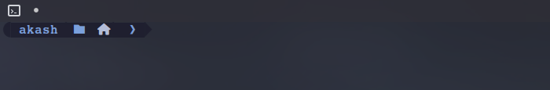

# NeonGrid Oh My Posh Theme

## Preview



## Requirements

- Oh My Posh
- Nerd Font or a patched font with Powerline/nerd icons
- Konsole terminal emulator
- Bash shell (or another supported shell)
- `~/bin` available in `PATH` if installing Oh My Posh there

## Installation

1. Install Oh My Posh:

```bash
curl -s https://ohmyposh.dev/install.sh | bash -s -- -d ~/bin
```

If you prefer the default install location:

```bash
curl -s https://ohmyposh.dev/install.sh | bash -s
```

2. Verify the installation:

```bash
oh-my-posh --version
```

3. Install the recommended font set:

```bash
oh-my-posh font install
```

If you want a specific patched font, use a Nerd Font build such as JetBrains Mono Nerd Font.

4. Clone this repository or copy the theme file:

```bash
git clone <repo-url> ~/ohmyposh-theme
cd ~/ohmyposh-theme
```

5. Place the theme file in your Oh My Posh config directory:

```bash
mkdir -p ~/.config/ohmyposh/themes
cp pixelrobots.omp.json ~/.config/ohmyposh/themes/
```

## Configuration

Enable the theme in your shell by adding the init line to `~/.bashrc`:

```bash
eval "$(oh-my-posh init bash --config ~/.config/ohmyposh/themes/pixelrobots.omp.json)"
```

If you want to generate the exact shell initialization snippet, run:

```bash
oh-my-posh get shell
```

Then add the output to your shell config file.

After editing:

```bash
source ~/.bashrc
```

## File Structure

- Theme file: pixelrobots.omp.json
- Recommended theme directory: `~/.config/ohmyposh/themes/`
- Legacy theme directories:
  - `~/.poshthemes`
  - `/usr/share/oh-my-posh/themes/`

## Customization

To customize the theme:

- Edit `~/.config/ohmyposh/themes/pixelrobots.omp.json`
- Change colors, segments, icons, or text templates
- Reload your shell after saving changes:

```bash
source ~/.bashrc
```

If you use another shell, replace `bash` with `zsh` or `fish` in the `oh-my-posh init` command.

## Troubleshooting

- Icons not showing?
  - Make sure Konsole is using a Nerd Font such as JetBrains Mono Nerd Font.
  - Restart Konsole after installing fonts.

- Theme not loading?
  - Confirm the theme path is correct:
    `~/.config/ohmyposh/themes/pixelrobots.omp.json`
  - Verify the shell init line is present in `~/.bashrc`.

- `oh-my-posh` command not found?
  - Ensure `~/bin` is in your `PATH` if installed there:
    `export PATH="$HOME/bin:$PATH"`

## Notes

- This theme is intended for Konsole with a patched Powerline/Nerd Font.
- If you are using a different shell, adapt the init command accordingly.
- The theme file should live alongside your Oh My Posh config files.

## License

MIT